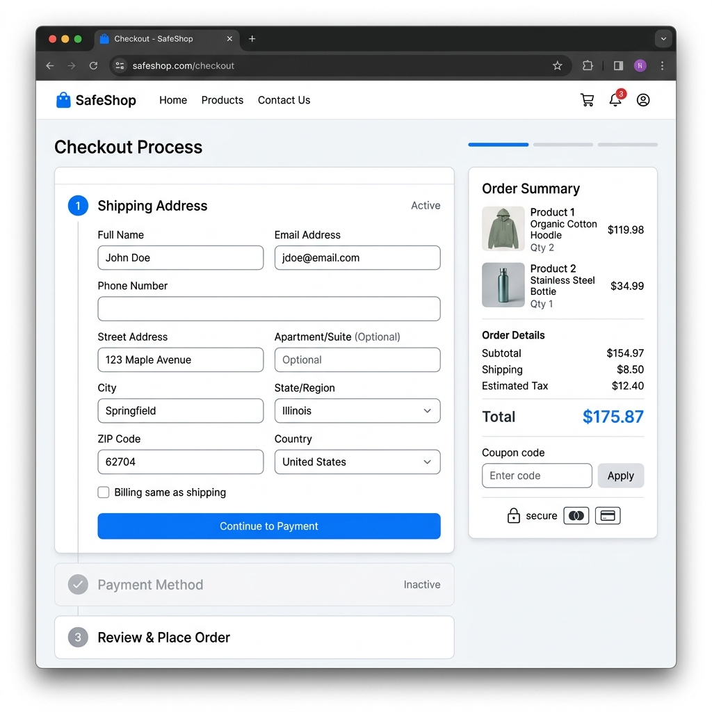
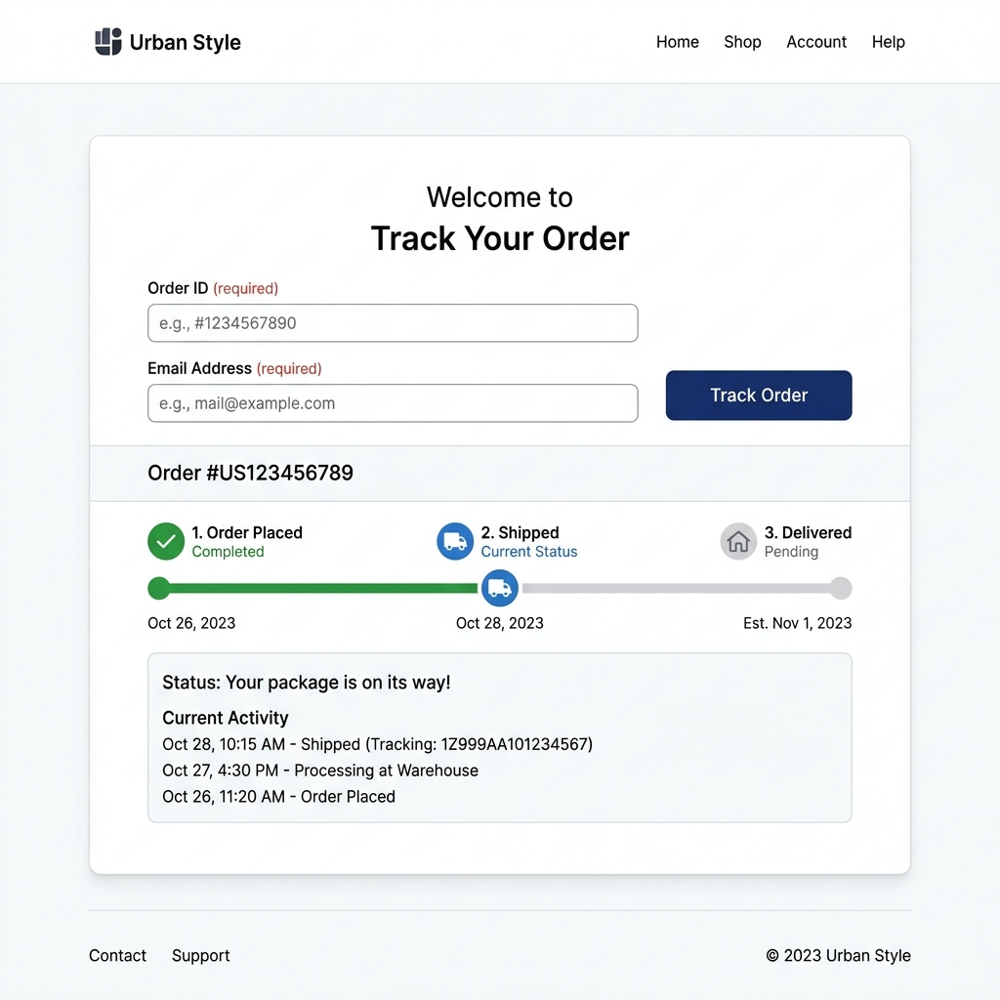

# 🛒 E-Commerce Django: My Awesome Cart

[](https://www.python.org/)
[](https://www.djangoproject.com/)
[](https://opensource.org/licenses/MIT)

A high-performance, full-featured e-commerce ecosystem architected with Django. This platform delivers a premium shopping experience featuring a modern, responsive design, real-time analytics, and secure payment integrations. Engineered for professional-grade deployment and seamless scalability.

---

## ✨ Enterprise Features

- **💎 Premium UI/UX**: Modern, mobile-first design system built with custom CSS variables and Google Fonts.
- **🛍️ Dynamic Product Engine**: Intelligent categorization with responsive slider architecture.
- **🔍 Elastic-style Search**: Instant filtering for a smooth discovery process.
- **🛒 Persistent State Cart**: Optimized shopping cart with JSON-based local persistence.
- **📦 Intelligent Tracking**: End-to-end order status monitoring system.
- **💳 Production-Ready Checkout**: Secure, multi-step checkout with address validation.
- **🚀 Scalable Architecture**: Configured for industry-standard deployment (Gunicorn, WhiteNoise, Render).
- **📰 Content Hub**: Integrated professional blog for SEO-driven marketing.
- **🛠️ Command Center**: Comprehensive admin suite for catalog, order, and customer management.

---

## 🛠️ Tech Stack

- **Backend**: Python 3.x, Django 2.2
- **Frontend**: HTML5, CSS3, JavaScript, Bootstrap 4
- **Database**: SQLite (Default), compatible with PostgreSQL/MySQL
- **Payments**: Paytm Payment Gateway API
- **Others**: Pillow (Image handling), PyCryptodome (Encryption)

---

## 📁 Project Structure

```text
E-Commerce_Django/
├── mac/                # Project configuration and core settings
├── shop/               # Main e-commerce app (Products, Cart, Checkout, Tracking)
├── blog/               # Blog management app
├── PayTm/              # Payment gateway integration logic
├── media/              # User-uploaded content (Product images)
├── docs/               # Documentation and screenshots
└── manage.py           # Django management script
```

---

## 🚀 Installation & Setup

### 1. Prerequisites
- Python 3.8+ installed.
- `pip` (Python package manager).

### 2. Clone & Setup Environment
```bash
# Clone the repository
git clone https://github.com/Priyanshu6861/E-Commerce_Django.git
cd E-Commerce_Django

# Create a virtual environment
python -m venv venv

# Activate virtual environment
# On Windows:
venv\Scripts\activate
# On macOS/Linux:
source venv/bin/activate
```

### 3. Install Dependencies
```bash
pip install -r requirements.txt
```

### 4. Database Setup & Migrations
```bash
python manage.py makemigrations
python manage.py migrate
```

### 5. Create Superuser (Admin)
```bash
python manage.py createsuperuser
```

### 6. Run the Project
```bash
python manage.py runserver
```
The application will be available at: `http://127.0.0.1:8000/`

---

## 📸 Screenshots

| Home Page | Product View | Cart & Checkout |
|:---:|:---:|:---:|
|  |  |  |

| Order Tracker | Blog Section | Admin Panel |
|:---:|:---:|:---:|
|  |  |  |

> *Note: Place actual screenshots in `docs/screenshots/` to view them here.*

---

## 🔐 Admin Panel Access

Manage the entire store by visiting: `http://127.0.0.1:8000/admin/`
Use the credentials created during the **Superuser** setup.

---

## 💳 Payment Integration Note
The Paytm integration requires a valid `MERCHANT_KEY`. For production, update the `MERCHANT_KEY` in `shop/views.py` and configure your Paytm dashboard credentials.

---

## 🤝 Contributing
Contributions are welcome! Feel free to open an issue or submit a pull request.

---

## 📄 License
Distributed under the MIT License. See `LICENSE` for more information.

---

---

## 🚀 Render Deployment

This project is configured for easy deployment on [Render](https://render.com/).

### 1. Create a New Web Service
- Connect your GitHub repository to Render.
- Select **Python** as the runtime.

### 2. Configure Settings
- **Build Command**: `./build.sh`
- **Start Command**: `gunicorn mac.wsgi:application`

### 3. Environment Variables
Add the following environment variables in the Render dashboard:
- `SECRET_KEY`: A long random string for production security.
- `DEBUG`: `False`
- `DATABASE_URL`: (Optional) Your PostgreSQL database URL. If not provided, SQLite will be used (data will not persist on restarts).
- `PYTHON_VERSION`: `3.10.12`

---

## 👨‍💻 Author
**Priyanshu**
- GitHub: [@Priyanshu6861](https://github.com/Priyanshu6861)
- Portfolio: [Your Portfolio Link Here]
- LinkedIn: [Your LinkedIn Profile Here]
